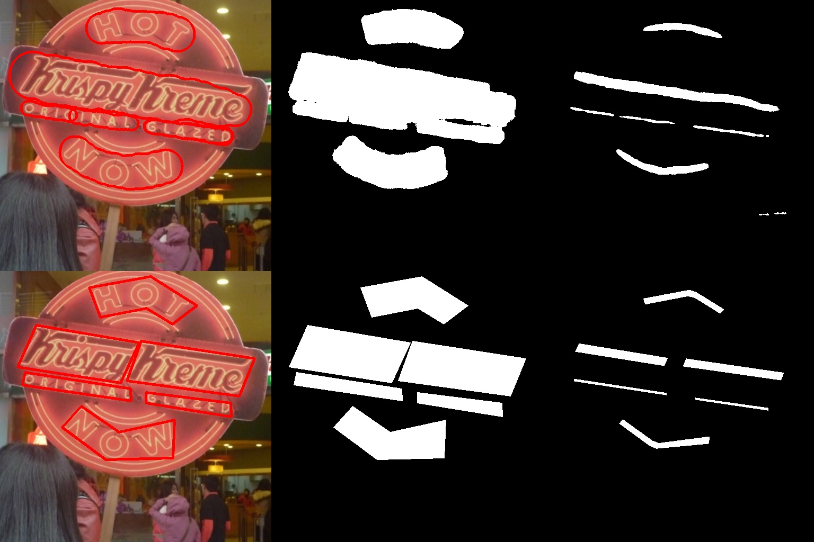
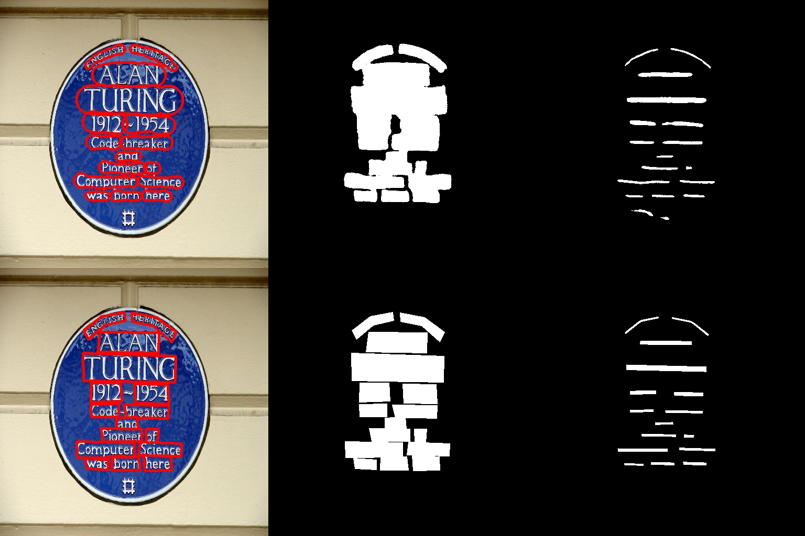
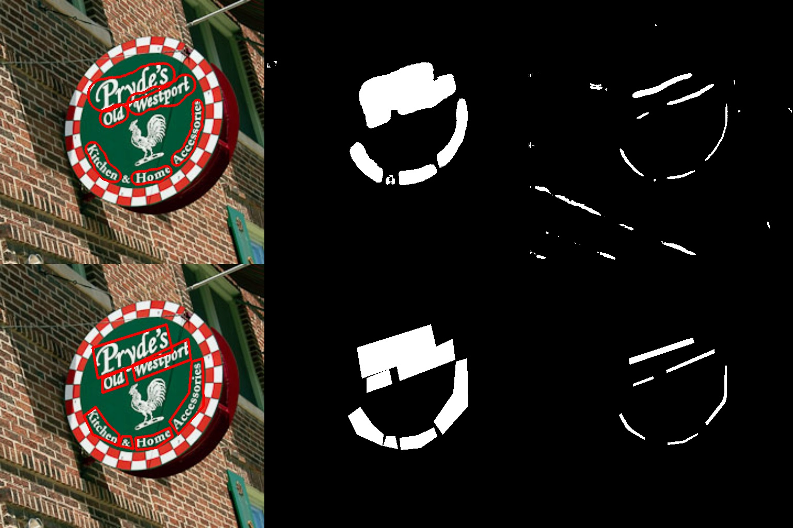
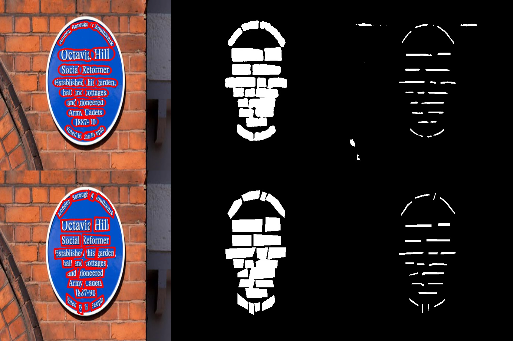

# TextSnake: A Flexible Representation for Detecting Text of Arbitrary Shapes

A PyTorch implement of **TextSnake: A Flexible Representation for Detecting Text of Arbitrary Shapes** (ECCV 2018) by `Megvii`

- Paper link: [arXiv:1807.01544](https://arxiv.org/abs/1807.01544)
- Github: [princewang1994/TextSnake.pytorch](https://github.com/princewang1994/TextSnake.pytorch)
- Blog: [TextSnake: A Flexible Representation for Detecting Text of Arbitrary Shapes](http://blog.prince2015.club/2019/01/06/TextSnake/)

<div style="color:#0000FF" align="center">
 
</div>

## Paper


Comparison of different representations for text instances. (a) Axis-aligned rectangle. (b) Rotated rectangle. (c) Quadrangle. (d) TextSnake. Obviously, the proposed TextSnake representation is able to effectively and precisely describe the geometric properties, such as location, scale, and bending of curved text with perspective distortion, while the other representations (axis-aligned rectangle, rotated rectangle or quadrangle) struggle with giving accurate predictions in such cases.

<div style="color:#0000FF" align="center">
 
</div>


Textsnake elements:

- center point
- tangent line
- text region

## Description

Generally, this code has following features:

1. include complete training and inference code
2. pure python version without extra compiling
3. compatible with laste PyTorch version (write with pytroch 0.4.0)
4. support [TotalText](https://github.com/cs-chan/Total-Text-Dataset) and [SynthText](http://www.robots.ox.ac.uk/~vgg/data/scenetext/) dataset


## Getting Started

This repo includes the training code and inference demo of TextSnake, training and infercence can be simplely run with a  few code. 

### Prerequisites

To run this repo successfully, it is highly recommanded with:

- **Linux (Ubuntu 16.04)**
- **Python3.6**
- **Anaconda3**
- **NVIDIA GPU(with 8G or larger GPU memory for training, 2G for inference)**

(I haven't test it on other Python version.)

1. clone this repository

```shell
git clone https://github.com/princewang1994/TextSnake.pytorch.git
```

2. python package can be installed with `pip`
```shell
$ cd $TEXTSNAKE_ROOT
$ pip install -r requirements.txt
```

## Data preparation

* `Total-Text`: follow the [dataset/total_text/README.md](dataset/total_text/README.md)
* `SynthText`: follow the [datset/synth-text/README.md](dataset/synth-text/README.md)

## Pretraining with SynthText

```shell
$ CUDA_VISIBLE_DEVICES=$GPUID python train.py synthtext_pretrain --dataset synth-text --viz --max_epoch 1 --batch_size 8
```

## Training

Training model with given experiment name `$EXPNAME`

training from scratch:
```shell
$ EXPNAME=example
$ CUDA_VISIBLE_DEVICES=$GPUID python train.py $EXPNAME --viz
```

training with pretrained model(improved performance much)
```shell
$ EXPNAME=example
$ CUDA_VISIBLE_DEVICES=$GPUID python train.py example --viz --batch_size 8 --resume save/synthtext_pretrain/textsnake_vgg_0.pth
```

**options:**

- `exp_name`: experiment name, used to identify different training processes
- `--viz`: visualization toggle, output pictures are saved to `./vis` by default

other options can be show by run `python train.py -h`

## Running tests

Runing following command can generate demo on TotalText dataset (300 pictures), the result are save to `./vis` by default

```shell
$ EXPNAME=example
$ CUDA_VISIBLE_DEVICES=$GPUID python eval_textsnake.py $EXPNAME --checkepoch 190
```

**options:**

- `exp_name`: experiment name, used to identify different training process

other options can be show by run `python train.py -h`

## Evaluation

Total-Text metric is included in `dataset/total_text/Evaluation_Protocol/Python_scripts/Deteval.py`, you should first modify the `input_dir` in `Deteval.py` and run following command for computing DetEval:

```shell
$ python dataset/total_text/Evaluation_Protocol/Python_scripts/Deteval.py $EXPNAME --tr 0.8 --tp 0.4
```

or

```shell
$ python dataset/total_text/Evaluation_Protocol/Python_scripts/Deteval.py $EXPNAME --tr 0.7 --tp 0.6
```

it will output metrics reports.

## Pretrained Models

- SynthText pretrained model: [synthtext_fixlr/textsnake_vgg_0.pth](https://pan.baidu.com/s/1Q4D3pDyVP7qdi2Cs-vc9cQ) (extract code: `xmoh`)
- Total-Text pretrained model: [finetune_larger_tcl/textsnake_vgg_180.pth](https://pan.baidu.com/s/11_PTTyxU4JMt91HV_4niBg) (extract code: `dms6`)
- Google Drive: [TextSnake_pretrain](https://drive.google.com/drive/folders/1omMmL8nkdPk43SVOOQMD9AkpE-tztqkf?usp=sharing)

Download from links above and place `pth` file to the corresponding path(`save/XXX/textsnake_vgg_XX.pth`).

## Performance

### DetEval reporting

Following table reports `DetEval` metrics when we set `vgg` as the backbone(can be reproduced by using pertained model in `Pretrained Model` section):

|                      | tr=0.7 / tp=0.6(P\|R\|F1)   | tr=0.8 / tp=0.4(P\|R\|F1)   | FPS(On single 1080Ti) |
| -------------------- | :-------------------------- | :-------------------------- | :-------------------- |
| expand / no merge    | 0.652 \| 0.549 \| 0.596     | **0.874 \| 0.711 \| 0.784** | **12.07**             |
| expand / merge       | 0.698 \| 0.578 \| 0.633     | 0.859 \| 0.660 \| 0.746     | 8.38                  |
| no expand / no merge | **0.753 \| 0.693 \| 0.722** | 0.695 \| 0.628 \| 0.660     | 9.94                  |
| no expand / merge    | 0.747 \| 0.677 \| 0.710     | 0.691 \| 0.602 \| 0.643     | 11.05                 |
| reported on paper    | -                           | 0.827 \| 0.745 \| 0.784     |                       |

\* `expand` denotes expanding radius by 0.3 times while post-processing

\* `merge` denotes that merging overlapped instance while post-processing

## Pure Inference

You can also run prediction on your own dataset without annotations:

1. Download pretrained model and place `.pth` file to `save/pretrained/textsnake_vgg_180.pth`
2. Run pure inference script as following: 

```shell
$ EXPNAME=pretrained
$ CUDA_VISIBLE_DEVICES=$GPUID python demo.py $EXPNAME --checkepoch 180 --img_root /path/to/image
```

predicted result will be saved in `output/$EXPNAME` and visualization in `vis/${EXPNAME}_deploy`

### Qualitative results

- left: prediction/ground true
- middle: text region(TR)
- right: text center line(TCL)









## What is comming

- [x] Pretraining with SynthText
- [x] Metric computing
- [x] Pretrained model upload
- [x] Pure inference script
- [ ] More dataset suport: [ICDAR15, CTW1500]
- [ ] Various backbone experiments

## License

This project is licensed under the MIT License - see the [LICENSE.md](LICENSE.md) file for details

## Acknowledgement

* This project is writen by [Prince Wang](https://github.com/princewang1994), part of codes refer to [songdejia/EAST](https://github.com/songdejia/EAST)
* Thanks [techkang](https://github.com/techkang) for your great help!