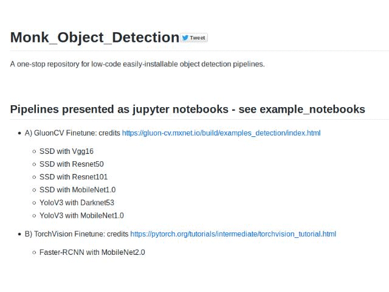

# Monk_Object_Detection   

A one-stop repository for low-code easily-installable object detection pipelines.
 
 
 

 
 

## Pipelines presented as jupyter notebooks - see example_notebooks
(See the licenses for each pipeline and use accordingly)

- A) GluonCV Finetune: Original -  https://gluon-cv.mxnet.io/build/examples_detection/index.html
    - SSD with Vgg16
    - SSD with Resnet50
    - SSD with Resnet101
    - SSD with MobileNet1.0
    - YoloV3 with Darknet53
    - YoloV3 with MobileNet1.0
    
- B) TorchVision Finetune: Original - https://pytorch.org/tutorials/intermediate/torchvision_tutorial.html
    - Faster-RCNN with MobileNet2.0
    
- C) MX-RCNN: Original - https://github.com/ijkguo/mx-rcnn
    - Faster-RCNN with VGG16
    - Faster-RCNN with Resnet50
    - Faster-RCNN with Resnet101
    
- D) Efficient-Det: Original -  https://github.com/signatrix/efficientdet

- E) Pytorch-Retinanet: Original - https://github.com/yhenon/pytorch-retinanet
    - Resnet18
    - Resnet34
    - Resnet50
    - Resnet101
    - Resnet152
    
- F) CornerNet-Lite: Original - https://github.com/princeton-vl/CornerNet-Lite
    - CornerNet-Saccade
    - CornerNet-Squeeze
    
- G) YOLOV3: Original - https://github.com/ultralytics/yolov3
    - yolov3
    - yolov3s
    - yolov3-spp
    - yolov3-spp3
    - yolov3-tiny
    - yolov3-spp-matrix
    - csresnext50-panet-spp

      
 
 
 

## Installation
- A) GluonCV Finetune
    - Check - Monk_Object_Detection/1_gluoncv_finetune/

- B) TorchVision Finetune
    - Check - Monk_Object_Detection/2_pytorch_finetune/
    
- C) MX-RCNN
    - Check - Monk_Object_Detection/3_mxrcnn/
      
- D) Efficient-Det
    - Check - Monk_Object_Detection/4_efficientdet/
    
- E) Pytorch-Retinanet
    - Check - Monk_Object_Detection/5_pytorch_retinanet/
    
- F) CornerNet-Lite
    - Check - Monk_Object_Detection/6_cornernet_lite/
    
- G) YoloV3
    - Check - Monk_Object_Detection/7_yolov3/

 
 
 

## Author
Tessellate Imaging - https://www.tessellateimaging.com/
   
Check out Monk AI - (https://github.com/Tessellate-Imaging/monk_v1)
    
    Monk features
        - low-code
        - unified wrapper over major deep learning framework - keras, pytorch, gluoncv
        - syntax invariant wrapper

    Enables developers
        - to create, manage and version control deep learning experiments
        - to compare experiments across training metrics
        - to quickly find best hyper-parameters

To contribute to Monk AI or Monk Object Detection repository raise an issue in the git-repo or dm us on linkedin 
   - Abhishek - https://www.linkedin.com/in/abhishek-kumar-annamraju/
   - Akash - https://www.linkedin.com/in/akashdeepsingh01/
 
 
 

## Copyright

Copyright 2019 onwards, Tessellate Imaging Private Limited Licensed under the Apache License, Version 2.0 (the "License"); you may not use this project's files except in compliance with the License. A copy of the License is provided in the LICENSE file in this repository.
